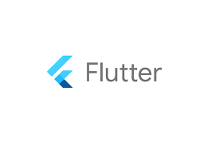

# foodapp

## Getting Started

This project is a starting point for a Flutter application.

A few resources to get you started if this is your first Flutter project:

- [Lab: Write your first Flutter app](https://flutter.dev/docs/get-started/codelab)
- [Cookbook: Useful Flutter samples](https://flutter.dev/docs/cookbook)

For help getting started with Flutter, view our
[online documentation](https://flutter.dev/docs), which offers tutorials,
samples, guidance on mobile development, and a full API reference.

## Báo cáo
                                                             **Lời nói đầu**
    Hiện nay công nghệ số đang ngày càng phát triển, hầu hết mỗi người chúng ta đều sử dụng một chiếc điện thoại smartphone trong việc  làm  cũng như giải trí của mình. Người sử dụng smartphone khoảng hơn 5 tiếng mỗi ngày trong hầu hết mọi công việc xung quanh họ.

    Để phục vụ cho nhu cầu đó các nhà phát triển cũng cần tạo ra ứng dụng một cách nhanh chóng và tiết kiệm cả về thời gian và tiền bạc. 

    Để có thể phát triển ứng dụng như vậy lập trinh viên có thể sử dụng Flutter – một Cross Platform được phát triển bởi Google để tạo các ứng dụng trên iOS, Android và cả web.

    Trong phạm vi bài tập  môn học ta sẽ tìm hiểu về Flutter và phát triển ứng dụng cho nền tảng Android bằng Flutter.

### 	I. Tổng quan đề tài
- Trước khi smartphone trở nên phổ biến để ghi nhớ lại các công thức món ăn, người ta sẽ sử dụng sổ tay hay giấy nhớ. Hiện nay với sự phổ biến của smartphone và thiết bị thông minh, con người có thể dùng các ứng dụng ghi nhớ trên các thiết bị thông minh để viết công thức.
- Một ứng dụng nấu ăn sẽ có thể giúp người dùng nấu ăn ngon hơn hoặc chỉ đơn giản là giảm bớt gánh nặng trong tâm trí khi phải ghi nhớ quá nhiều việc cần làm.
- Do đó trong phạm vi môn học này ta sẽ phát triển một ứng dụng “cooking” trên nền tảng Android với Flutter giúp người dùng cải thiện trình độ nấu nướng.
- Để có thể thực hiện được ta sẽ tìm hiểu:
    o	Flutter và ngôn ngữ Dart
    o	Sử dụng API
- Ứng dụng được tạo ra sẽ có các chức năng chính như:
    o	Lựa chọn thực đơn món ăn các nước
    o	Tìm nguyên liệu
    o	Thêm sửa xóa nguyên liệu
##      II.Tìm hiểu về Flutter

1.	Flutter là gì?
-	Flutter là một bộ công cụ giao diện người dùng của Google (Google’s UI) để tạo ra các ứng dụng đẹp, được biên dịch nguyên bản cho các thiết bị di động (Android, iOS), web và cả máy tính từ một codebase duy nhất.
-	Flutter được tạo ra nhằm giải quyết bài toan thường gặp khi phát triển ứng dụng di động là “Fast Development” và “Native Performance”.
-	Flutter bao gồm 2 thành phần quan trọng:
    o	SDK bao gồm các thư viện, công cụ giúp người dùng phát triển ứng dụng và biên dịch mã này sang mã gốc cho các nền tảng khác nhau như iOS, Android hay Web
    o	Framework gồm các thanh phần giao diện người dùng có thể tái sử dụng (button, textfield,…) giúp lập trình viên có thể tạo ra ứng dụng của riêng mình.
-	Flutter đang được sử dụng bởi tổ chức lớn trên khắp thế giới như: Google, Alibaba, ebay, Tencent, BMW….
2.	Các đặc điểm nổi bật của Flutter
-	Phát triển nhanh: 
o	Với tinh năng hot reload giúp lập trình viên có thể nhanh chóng và dễ dàng thử nghiệm, xây dựng giao diện người dùng, thêm tính năng và sửa lỗi. 
o	Hot reload hoạt động bằng cách cập nhật các tệp mã nguồn vào máy ảo Dart đang chạy. Sau khi máy ảo cập nhật các lớp với các phiên bản mới của các trường và chức năng, Flutter framework sẽ tự động xây dựng lại cây widget và cho phép lập trình viên có thể nhanh chóng xem lại ảnh hưởng của các thay đổi.
-	Tạo ra giao diện đẹp
o	Flutter tích hợp sẵn các tiện ích Material Design và Cupertino, các API chuyển động phong phú, cuộn mượt tự nhiên
-	Hiệu suất như các ứng dụng Native
o	Các tiện ích con của Flutter kết hợp tất cả các điểm khác biệt quan trọng của nền tảng như cuộn, điều hướng, biểu tượng và phông chữ để mang lại hiệu suất gốc đầy đủ trên cả iOS và Android.

               
    

                        